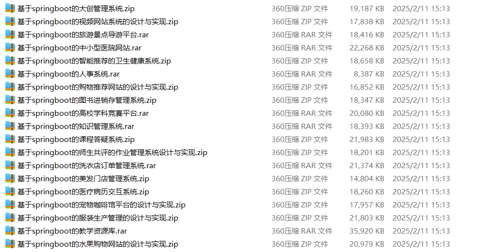

# springboot_food_museum_airline

📦 SpringBoot多功能项目仓库 🎯

本仓库汇集了三个基于 **Spring Boot** 开发的高实用性项目，涵盖 **美食推荐、美术馆管理、民航订票** 等多个领域，适用于学习、开发实践和功能拓展！🚀

🍽️ **美食信息推荐系统** —— 提供**美食分类、个性化推荐、菜品评分、用户评论、餐厅管理、美食排行榜、智能搜索、附近美食导航**，优化**美食推荐体验** 🍜✅

🖼️ **美术馆管理系统** —— 支持**展览管理、藏品管理、艺术品预订、门票预约、观展导览、艺术家信息管理、用户互动、展馆运营分析**，提升**美术馆管理效率** 🎭🏛️

✈️ **民航网上订票系统** —— 实现**航班查询、机票预订、订单管理、航班动态查询、在线值机、乘客信息管理、登机提醒、退改签管理**，优化**航空票务管理** 📋✅

**项目部署说明**✨：

推荐使用：**谷歌浏览器**

**后台地址**😎

http://localhost:8080/springboot/admin/dist/index.html

**前台地址**😎

http://localhost:8080/springboot/front/index.html

在**src\main\resources\application.yml中**编辑数据库配置🎉										
url:jdbc:mysql://127.0.0.1:3306/springbootuseUnicode=true&characterEncoding=utf8&useJDBCCompliantTimezoneShift=true&useLegacyDatetimeCode=false&serverTimezone=UTC
username: root
password: 123456

**文档预览**👀

**其他项目合集**✨

